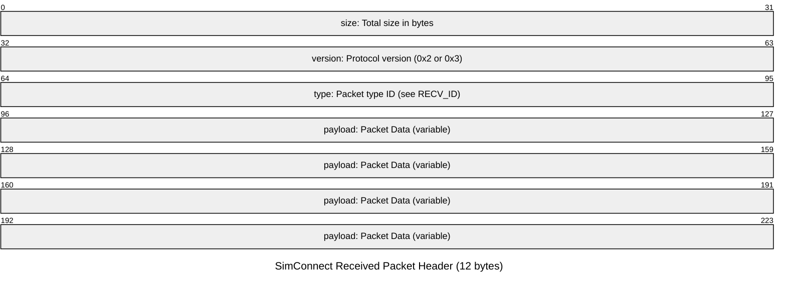

Inspired by (and with code borrowed from) [github.com/lian/msfs2020.go](https://github.com/lian/msfs2020-go)

Reference material [jsimconnect](https://github.com/mharj/jsimconnect)

## SimConnect Packet Structure

### Sent Packet Format
All integers sent, including headers, are in little-endian Intel format. The 16-byte header consists of 4 int32 fields:

| Offset | Field                | Description                                                      |
|--------|----------------------|------------------------------------------------------------------|
| 0      | Packet Size          | Total size in bytes of the packet (including header)             |
| 4      | Protocol Version     | 0x2 for FSX original, 0x3 for SP1, 0x4 for SP2                   |
| 8      | Packet Type ID       | Each function has a predefined type, usually 1 to 0x3F, OR'ed with 0xF0000000 |
| 12     | Packet Identifier    | Unique identifier, usually a sequence number                     |

#### Sent Packet Format (Mermaid Diagram)

### Received Packet Format
All received packets are sent to the DispatchProc. The header is 12 bytes:

| Offset | Field                | Description                                                      |
|--------|----------------------|------------------------------------------------------------------|
| 0      | Packet Size          | Total size in bytes                                              |
| 4      | Protocol Version     | 0x2 or 0x3                                                       |
| 8      | Packet Type ID       | See the numbers in the RECV_ID enumeration                       |

#### Received Packet Format (Mermaid Diagram)

### Example Packet Type IDs

| Function                              | Packet Type ID |
|----------------------------------------|:--------------:|
| Open                                  | 0x01           |
| QueryPerformanceCounter                | 0x03           |
| MapClientEventToSimEvent               | 0x04           |
| TransmitClientEvent                    | 0x05           |
| SetSystemEventState                    | 0x06           |
| AddClientEventToNotificationGroup      | 0x07           |
| RemoveClientEvent                      | 0x08           |
| SetNotificationGroupPriority           | 0x09           |
| ClearNotificationGroup                 | 0x0A           |
| RequestNotificationGroup               | 0x0B           |
| AddToDataDefinition                    | 0x0C           |
| ClearDataDefinition                    | 0x0D           |
| RequestDataOnSimObject                 | 0x0E           |
| RequestDataOnSimObjectType             | 0x0F           |
| SetDataOnSimObject                     | 0x10           |
| MapInputEventToClientEvent             | 0x11           |
| SetInputGroupPriority                  | 0x12           |
| RemoveInputGroup                       | 0x13           |
| SetInputGroupState                     | 0x14           |
| RequestReservedKey                     | 0x15           |
| SubscribeToSystemEvent                 | 0x16           |
| UnsubscribeFromSystemEvent             | 0x17           |
| WeatherRequestInterpolatedObservation  | 0x18           |
| WeatherRequestObservationAtStation     | 0x1A           |
| WeatherCreateStation                   | 0x1B           |
| WeatherRemoveStation                   | 0x1C           |
| WeatherSetObservation                  | 0x1D           |
| WeatherSetModeServer                   | 0x1E           |
| WeatherSetModeTheme                    | 0x1F           |
| WeatherSetModeGlobal                   | 0x20           |
| WeatherSetModeCustom                   | 0x21           |
| WeatherSetDynamicUpdateRate            | 0x22           |
| WeatherRequestCloudState               | 0x23           |
| WeatherCreateThermal                   | 0x24           |
| WeatherRemoveThermal                   | 0x25           |
| AICreateParkedATCAircraft              | 0x27           |
| AICreateEnrouteATCAircraft             | 0x28           |
| AICreateNonATCAircraft                 | 0x29           |
| AICreateSimulatedObject                | 0x2A           |
| AIReleaseControl                       | 0x2B           |
| AIRemoveObject                         | 0x2C           |
| AISetAircraftFlightPlan                | 0x2D           |
| ExecuteMissionAction                   | 0x2E           |
| CompleteCustomMissionAction            | 0x2F           |
| RequestMissionAction                   | 0x30           |
| RequestCustomMissionAction             | 0x31           |
| AICreateAirportVehicle                 | 0x32           |
| AICreateSimulatedObject2               | 0x33           |
| AICreateFormation                      | 0x34           |
| AISetFormationFlightPlan               | 0x35           |
| AISetFormationLeader                   | 0x36           |
| MapClientDataNameToID                  | 0x37           |
| CreateClientData                       | 0x38           |
| AddToClientDataDefinition              | 0x39           |
| ClearClientDataDefinition              | 0x3A           |
| RequestClientData                      | 0x3B           |
| SetClientData                          | 0x3C           |
| FlightSave                             | 0x3E           |
| FlightPlanLoad                         | 0x3F           |
| Text                                   | 0x40           |
| SubscribeToFacilities                  | 0x41           |
| UnSubscribeToFacilities                | 0x42           |
| RequestFacilitiesList                  | 0x43           |

For a full list, see the SimConnect and jsimconnect documentation.

---

A Go constants file with these packet type IDs is provided in `package/simconnect/constants.go`.